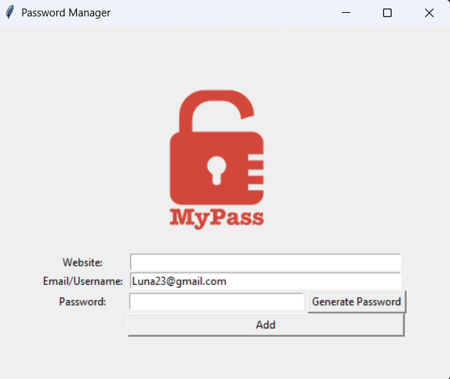

# 🔐 Password Manager

A secure, efficient, and beginner-friendly **Password Manager** built with **Python** and **Tkinter**. This application allows users to generate strong passwords, store login credentials for various websites, and retrieve them when needed — all in a clean and responsive GUI.

---

## 📷 Demo

---

## 📌 Overview

Managing passwords can be tedious and unsafe if not done properly. This **Password Manager** solves that problem by:

- Generating strong and random passwords
- Storing credentials in a local, structured JSON file
- Providing quick search functionality for saved data
- Ensuring ease-of-use through a graphical user interface

This is an ideal project for **Python learners**, **desktop app developers**, or anyone looking for an **offline personal password vault**.

---

## 🧠 Key Features

### 🔑 Password Generation
- Automatically creates strong, unpredictable passwords.
- Includes a mix of **uppercase and lowercase letters**, **numbers**, and **symbols**.
- Passwords are:
  - 8–10 letters
  - 2–4 symbols
  - 2–4 digits
- Generated passwords are **automatically copied to the clipboard** using `pyperclip`.

### 💾 Credential Storage
- User credentials (website, email, password) are stored in a `data.json` file.
- Uses structured JSON format to support easy updates and lookups.
- Automatically handles:
  - File creation if it doesn’t exist.
  - Merging of new credentials with existing data.
- Validates inputs to prevent empty fields.

### 🔍 Credential Search
- Enter the name of a website and click **Search**.
- If credentials exist, a message box displays the stored **email/username** and **password**.
- Handles errors like:
  - Missing `data.json` file
  - Website not found in stored records

### 📋 Clipboard Copy
- Generated passwords are instantly copied to your clipboard to simplify pasting into websites.

### 🖥️ Graphical User Interface
- Built using `Tkinter` for a simple, intuitive layout.
- Fields:
  - Website
  - Email/Username
  - Password
- Buttons:
  - **Generate Password**
  - **Add**
  - **Search**

---

## 💡 How It Works

### 🧪 Password Generator Logic
password_letters = [choice(letters) for _ in range(randint(8, 10))]

password_symbols = [choice(symbols) for _ in range(randint(2, 4))]

password_numbers = [choice(numbers) for _ in range(randint(2, 4))]

All characters are combined and shuffled.

Final password is inserted into the password entry field.

Password is copied to clipboard automatically.

### 💽 Save Credentials

When the user clicks Add, credentials are stored in data.json:

{
  "example.com": 
  {
    "email": "user@example.com",
    "password": "S@f3P@ssw0rd!"
  }
}

If the file does not exist or is empty, it creates a new one.

If it exists, the file is updated with the new entry.

### 🔍 Find Password

When the user enters a website name and clicks Search, the app:

Looks into data.json

Displays the stored email and password

Error messages are shown for:

Missing file

Website not found

---

## 🛠️ Tech Stack

| Technology | Purpose |
|------------|---------|
| **Python 3.x** | Programming language |
| **Tkinter** | GUI toolkit for UI |
| **JSON** | Data storage format |
| **random** | Used for password generation |
| **pyperclip** | Copies passwords to clipboard |
| **tkinter.messagebox** | For alerts and confirmation dialogs |
